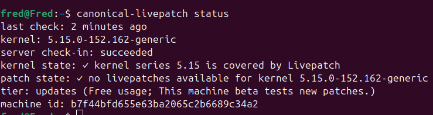

## Enable Livepatch for your system
The `Canonical Livepatch` patches high and critical Linux kernel vulnerabilities, removing the immediate need to reboot 
to upgrade the kernel, and instead allowing the downtime to be scheduled.
Canonical Livepatch is meant for critical infrastructure, where unscheduled downtime is to be avoided. By applying live 
kernel patches for high and critical kernel vulnerabilities, upgrades can be scheduled at a suitable time.

To enable livepatch for the virtual machine, proceed by executing the following command in the terminal:
```bash
sudo pro enable livepatch
```
The command above will install the livepatch client, and enroll the system to the Ubuntu livepatch service
You can start by checking the Livepatch status of the virtual machine 
```bash
canonical-livepatch status
```
This will produce output similar to this:
