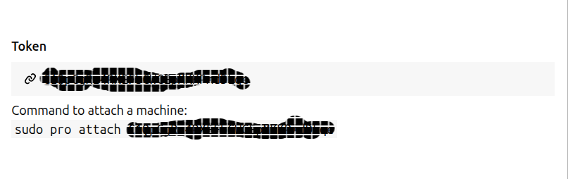

## Setting up
1. Navigate to the [Ubuntu Pro](https://ubuntu.com/pro) webpage and subscribe for Ubuntu Pro
2. Depending on your setup needs, you can get the subscription as an organization or for yourself. Signing up for
 a personal subscription will get you **5 machines** for you or any business you own, or **50 machines for active 
[Ubuntu Community members](https://ubuntu.com/community/membership).**
3. Once you've gotten a subscription and verified your Ubuntu Pro account, navigate to the 
[dashboard](https://ubuntu.com/pro/dashboard) page to view the token that you will use to activate your virtual machine.

4. Copy the command to attach to your virtual machine
```bash
sudo pro attach UBUNTU-PRO-TOKEN-HERE
```
5. After that command has executed successfully, you can check for available updates with the following command
```bash
sudo pro security-status
```

