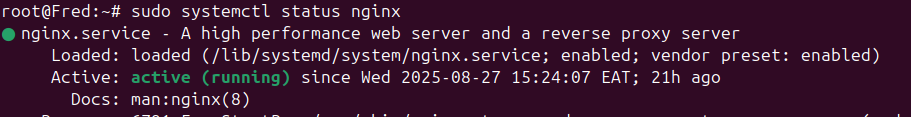

In your virtual machine, as the `root` user, navigate to the `/etc/nginx/sites-available`
```bash
# Switch to the root user
sudo -i

# Switch to the /var/www directory
cd /etc/nginx/sites-available
```

### 1. Create the UnitMaster conf file
```bash
nano unitmasterv2
```
Inside it, add the following content
```conf Expandable unitmasterv2
server {
    listen 443 ssl;
    server_name unitmaster.wizglobal.co.ke; # Replace with your domain

    root /var/www/unitmasterv2/public; # Your path to the public folder in your project

    index index.html index.htm index.php;
    
    ssl_protocols TLSv1.2 TLSv1.3;
    ssl_ciphers 'EECDH+AESGCM:EDH+AESGCM:AES256+EECDH:AES256+EDH';
    ssl_prefer_server_ciphers on;
    
    charset utf-8;

    location / {
        try_files $uri $uri/ /index.php?$query_string;
    }

    location ~ \.php$ {
	include snippets/fastcgi-php.conf;
        fastcgi_pass unix:/var/run/php/php8.2-fpm.sock; # This references PHP v8.2 that this project uses
        fastcgi_param SCRIPT_FILENAME $document_root$fastcgi_script_name;
        include fastcgi_params;
    }
}
```
### 2. Verify the Nginx configurations
```bash
nginx -t
```
You should see the following output printed out in the terminal
```bash
nginx: the configuration file /etc/nginx/nginx.conf syntax is ok
nginx: configuration file /etc/nginx/nginx.conf test is successful
```

### 3. Create a symlink
Create a symlink to the configuration file
```bash
sudo ln -s /etc/nginx/sites-available/unitmasterv2 /etc/nginx/sites-enabled/
```

### 4. Verify the symlink
```bash
ls -l /etc/nginx/sites-enabled/
```
You should see something similar to this:
```bash
lrwxrwxrwx 1 root root 39 Aug 15 14:57 unitmasterv2 -> /etc/nginx/sites-available/unitmasterv2
```

### 5. Restart the Nginx service
```bash
sudo systemctl restart nginx
```

### 6. Verify Nginx is working correctly
```bash
sudo systemctl status nginx
```
You should see an output similar to this:
