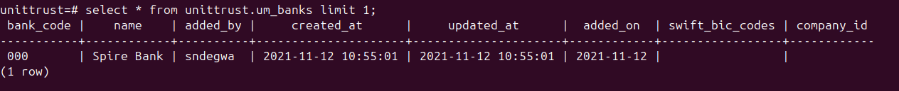

### 
### 1. Copy the backup SQL data file
Switch to the root user
```bash
sudo -i
```
Using the command below to move database SQL file you were provided, copy/move it to the `/var/lib/postgresql` directory
```bash
# Assuming the SQL file is in the home directory:
cp /home/fred/backup-db.sql /var/lib/postgresql
```

Navigate to the `/var/lib/postgresql` and change the SQL file's ownership
```bash
cd /var/lib/postgresql

ls
# Output
# backup-db.sql

# Change the ownership of the file to belong to the postgres user
chown postgres:postgres backup-db.sql
```

Confirm that the ownership changes have taken effect:
```bash
ls -lh
```
The output should be similar to the image below


### 2. Create the database
Switch to the postgres user to create your database
```bash
sudo -i -u postgres

# Switch to the psql shell
psql
```
You may be prompted for the `postgres` user's password you set earlier.

Create the database
```bash
CREATE DATABASE your_database_name; # i.e unittrust
```

Verify the database was created
```bash
\l

# You can use \q to exit the window showing you the list of databases
```

### 3. Import the data into the database
Import the sql file from the backup file
Exit the psql shell by executing `\q` and proceed to run the following command.
```bash
psql -U <username> -d <database_name> -f /var/lib/postgresql/backup-db.sql
```
Replace `username` and `database_name` with the user and database you created earlier on an
```bash
# For example
# psql -U postgres -d unittrust -f /var/lib/postgresql/backup-db.sql
```
Confirm the data has been loaded to the database
Switch to the psql shell while connecting to the database
```bash
psql -d <database_name>

# For example
# psql -d unittrust

# Run the following query to verify the data availability
SELECT * FROM <database_name>.um_banks LIMIT 1;

# For example
# SELECT * FROM unittrust.um_banks LIMIT 1;
```
You should see an output similar to this

