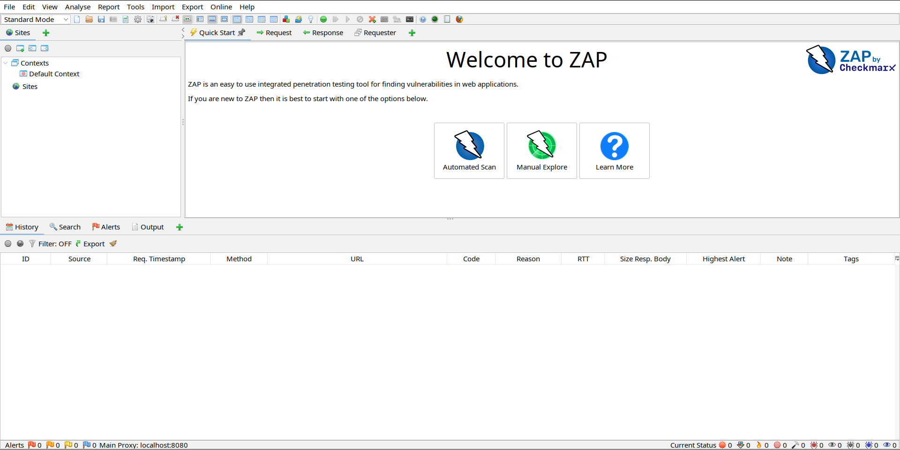
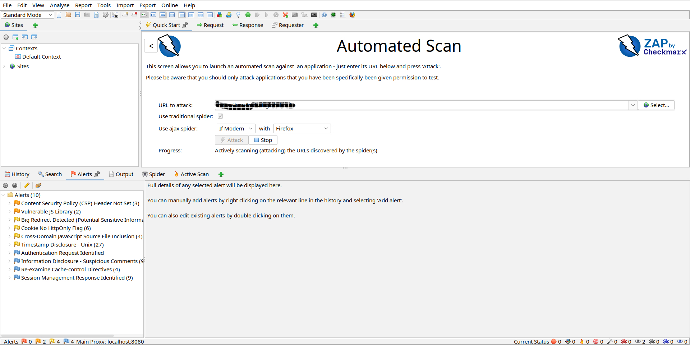

We'll be using ZAP (Zed Attack Proxy) to test our web apps for security vulnerabilities.

### 1. Open ZAP

### 2. Initiate a domain scan
- Select `Automated Scan` from the options displayed on the screen
- Fill in the `URL to attack` field with the domain you intend to test.
- Ensure the `Use traditional spider` option is checked
- Under `Use ajax spider`, select `If modern` from the first dropdown, and select your browser 
engine in the next dropdown i.e Firefox, Chrome etc
- Once you're done, click on `Attack` button to initiate the scan

### 3. View Alerts
As the scan keeps on going, proceed to click on the `Alerts` tab on the bottom screen to see the security alerts that need your attention to remedy

Clicking on each alert will give you a detailed description of the alert as well as possible solutions you can implement to fix the vulnerabilities.