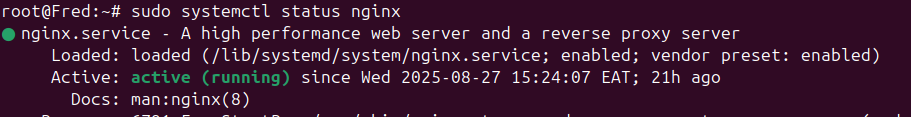

In your virtual machine, as the `root` user, navigate to the `/etc/nginx/sites-available`
```bash
# Switch to the root user
sudo -i

# Switch to the /var/www directory
cd /etc/nginx/sites-available
```

### 1. Create the UnitMaster Client Portal conf file
```bash
nano unitmaster_client_portal_api
```
Inside it, add the following content
```conf unitmaster_client_portal_api
server {
    listen 443;
    server_name api.wizglobal.co.ke; # Replace with your domain

    ssl_protocols TLSv1.2 TLSv1.3;
    ssl_ciphers 'EECDH+AESGCM:EDH+AESGCM:AES256+EECDH:AES256+EDH';
    ssl_prefer_server_ciphers on;
    
    location / {
        proxy_pass http://<IP_ADDRESS>:<PORT_NUMBER>; # Replace with the server IP Address and port number running the API
        proxy_set_header Host $host;
        proxy_set_header X-Real-IP $remote_addr;
        proxy_set_header X-Forwarded-For $proxy_add_x_forwarded_for;
        proxy_set_header X-Forwarded-Proto $scheme;
    }
}
```
### 2. Verify the Nginx configurations
```bash
nginx -t
```
You should see the following output printed out in the terminal
```bash
nginx: the configuration file /etc/nginx/nginx.conf syntax is ok
nginx: configuration file /etc/nginx/nginx.conf test is successful
```

### 3. Create a symlink
Create a symlink to the configuration file
```bash
sudo ln -s /etc/nginx/sites-available/unitmaster_client_portal_api /etc/nginx/sites-enabled/
```

### 4. Verify the symlink
```bash
ls -l /etc/nginx/sites-enabled/
```
You should see something similar to this:
```bash
lrwxrwxrwx 1 root root 39 Aug 15 14:57 unitmaster_client_portal_api -> /etc/nginx/sites-available/unitmaster_client_portal_api
```

### 5. Restart the Nginx service
```bash
sudo systemctl restart nginx
```

### 6. Verify Nginx is working correctly
```bash
sudo systemctl status nginx
```
You should see an output similar to this:
